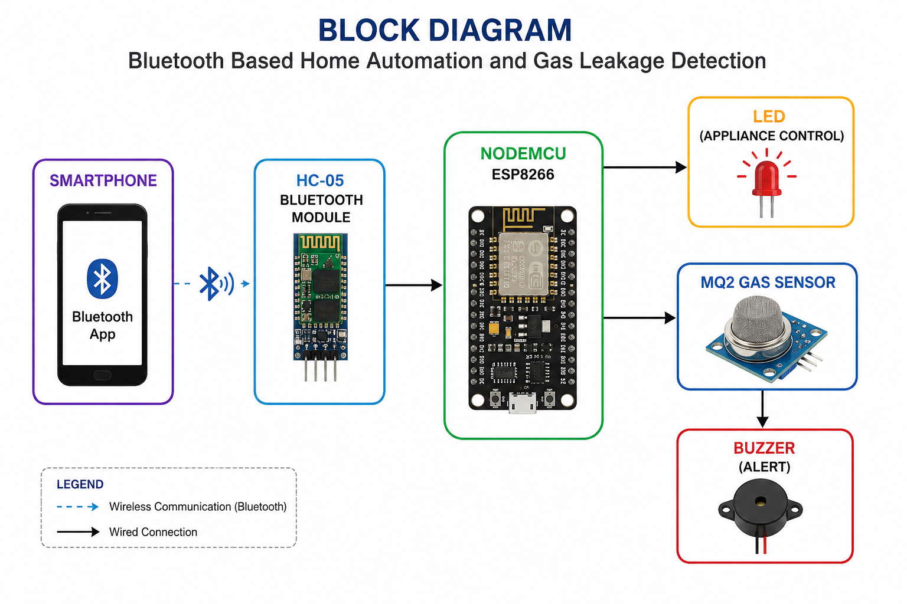
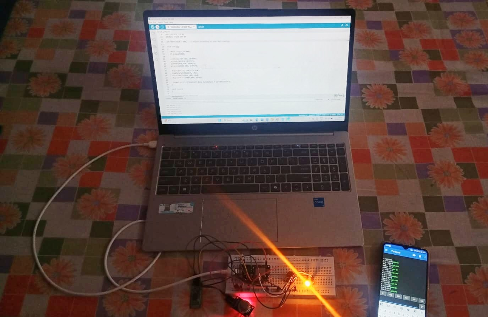

# Bluetooth-Based Home Automation and Gas Leakage Detection System

A Bluetooth-enabled smart home automation and gas leakage detection system developed using NodeMCU ESP8266, HC-05 Bluetooth Module, and MQ2 Gas Sensor.

---

## Overview

This project presents a Bluetooth-Based Home Automation and Gas Leakage Detection System developed using NodeMCU ESP8266, HC-05 Bluetooth Module, and MQ2 Gas Sensor. The system enables wireless control of appliances through a smartphone while simultaneously monitoring gas leakage conditions for enhanced safety.

The project integrates home automation and gas detection into a single embedded system, providing a simple, cost-effective, and reliable smart home solution.

---

## Objectives

* Control appliances wirelessly using Bluetooth communication.
* Establish communication between a smartphone and NodeMCU through the HC-05 module.
* Detect gas leakage using the MQ2 gas sensor.
* Generate alerts through LEDs and a buzzer when gas levels exceed a predefined threshold.
* Develop a low-cost and efficient smart home automation system.

---

## Components Used

### Hardware Components

| Component              | Specification                  | Quantity    |
| ---------------------- | ------------------------------ | ----------- |
| NodeMCU ESP8266        | ESP-12E Development Board      | 1           |
| HC-05 Bluetooth Module | Bluetooth v2.0 + EDR           | 1           |
| MQ2 Gas Sensor         | LPG/Smoke/Gas Sensor           | 1           |
| Active Buzzer          | 5V Buzzer                      | 1           |
| Green LED              | 5mm LED                        | 1           |
| Red LED                | 5mm LED                        | 1           |
| Breadboard             | Standard Breadboard            | 1           |
| Jumper Wires           | Male-Male / Male-Female        | As Required |
| USB Cable              | Micro USB Cable                | 1           |
| Smartphone             | Bluetooth Terminal Application | 1           |

### Software Components

* Arduino IDE
* Embedded C
* Serial Bluetooth Terminal App

---

## Circuit Connections

### HC-05 Bluetooth Module

| HC-05 Pin | NodeMCU Pin |
| --------- | ----------- |
| VCC       | VIN         |
| GND       | GND         |
| TXD       | RX          |
| RXD       | TX          |

### MQ2 Gas Sensor

| MQ2 Pin | NodeMCU Pin |
| ------- | ----------- |
| VCC     | VIN         |
| GND     | GND         |
| AO      | A0          |

### LEDs

| Component | NodeMCU Pin |
| --------- | ----------- |
| Green LED | D5          |
| Red LED   | D3          |

### Buzzer

| Buzzer Pin   | Connection |
| ------------ | ---------- |
| Positive (+) | D2         |
| Negative (-) | GND        |

---

## System Architecture

### Architecture Description

1. The smartphone sends commands through a Bluetooth Terminal application.
2. HC-05 receives the Bluetooth commands and forwards them to the NodeMCU.
3. NodeMCU processes the received commands and controls the connected LED.
4. MQ2 continuously monitors gas concentration levels.
5. When gas concentration exceeds the threshold value, the buzzer and alert LED are activated.

---

## Project Setup

---

## Working Principle

### Home Automation

* User sends commands from a smartphone.
* HC-05 receives commands via Bluetooth.
* NodeMCU processes the received commands.
* LED is switched ON/OFF based on user input.

### Gas Leakage Detection

* MQ2 sensor continuously monitors gas concentration.
* NodeMCU reads sensor values through the analog pin.
* If gas concentration exceeds the predefined threshold:

  * Red LED turns ON.
  * Buzzer is activated.
* The user is alerted about potential gas leakage.

---

## Project Demonstration

A demonstration video of the project is available in the repository.

[Watch Demo Video](Videos/demo.mp4)

The demonstration video showcases:

* Bluetooth communication between smartphone and NodeMCU.
* Wireless LED control through the mobile application.
* Real-time gas leakage monitoring.
* Alert generation using buzzer and LEDs.

---

## Results

* Successfully established Bluetooth communication using HC-05.
* Achieved wireless appliance control through smartphone commands.
* Implemented real-time gas leakage detection using MQ2 sensor.
* Generated immediate alerts through buzzer and LEDs during gas leakage conditions.
* Achieved reliable operation after communication and sensor calibration testing.

---

## Challenges Faced

* HC-05 communication and pairing issues.
* TX/RX connection troubleshooting.
* Baud rate mismatch during serial communication.
* MQ2 sensor threshold calibration.
* Hardware debugging and connection verification.

These challenges were resolved through systematic testing and debugging.

---

## Future Enhancements

* Control actual household appliances using relay modules.
* Develop a dedicated Android application.
* Integrate Wi-Fi and IoT cloud platforms.
* Enable remote monitoring through the internet.
* Add SMS and push notification alerts.
* Integrate additional environmental sensors for advanced smart home functionality.

---

## Technologies Used

* Embedded Systems
* Internet of Things (IoT)
* NodeMCU ESP8266
* HC-05 Bluetooth Module
* MQ2 Gas Sensor
* Arduino IDE
* Embedded C
* Bluetooth Communication

---

## Project Contributions

* Hardware assembly and circuit connections.
* NodeMCU programming using Arduino IDE.
* HC-05 Bluetooth module interfacing.
* MQ2 gas sensor integration.
* System testing and debugging.
* Validation of project functionality.

---

## Learning Outcomes

Through this project, valuable experience was gained in:

* Embedded Systems Development
* IoT Fundamentals
* Bluetooth Communication
* Sensor Interfacing
* Hardware Debugging
* Microcontroller Programming
* System Testing and Validation
* Problem Solving and Troubleshooting

---

## Author

**Kavya Dodla**

B.Tech Student | Embedded Systems & IoT Enthusiast
